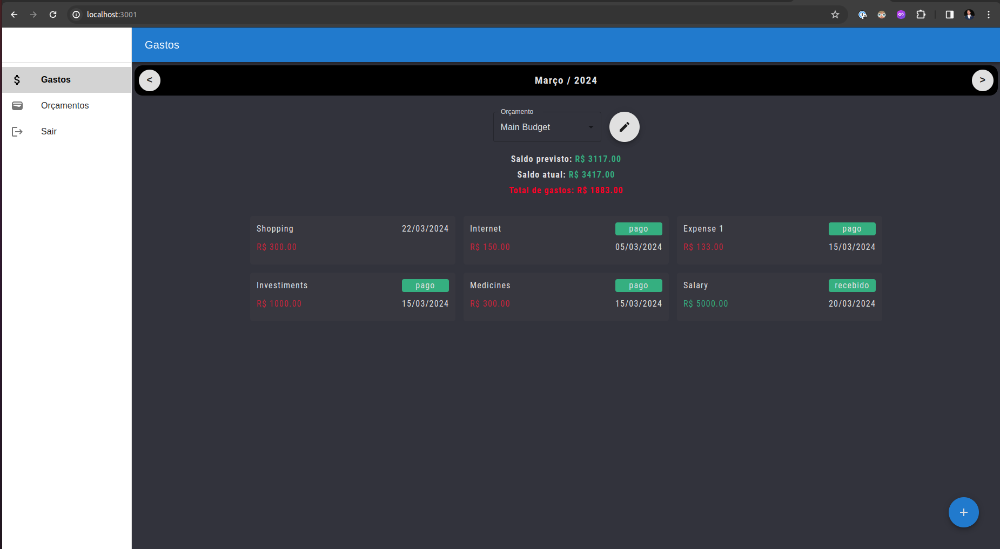
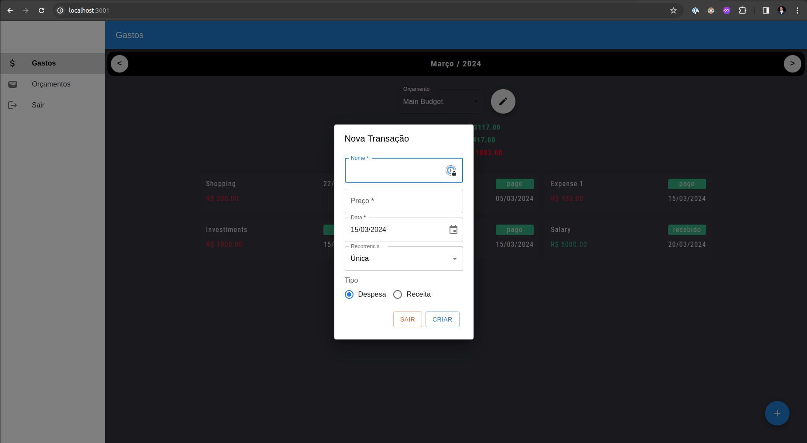
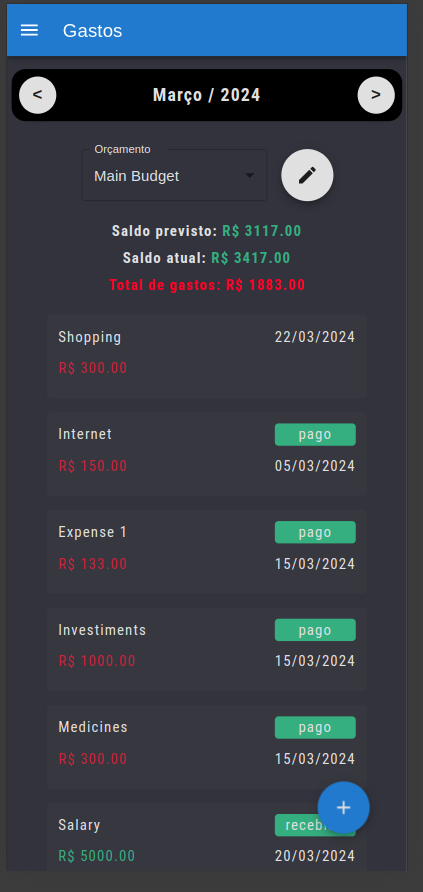
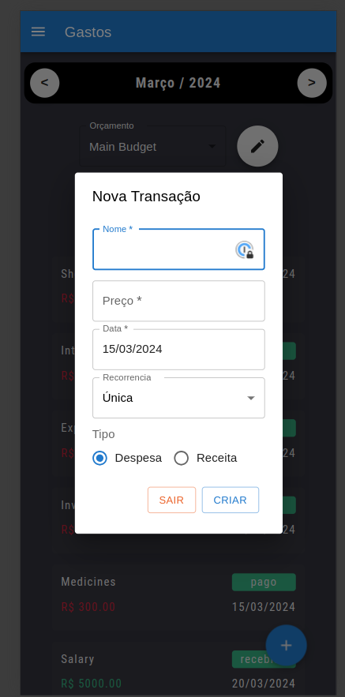
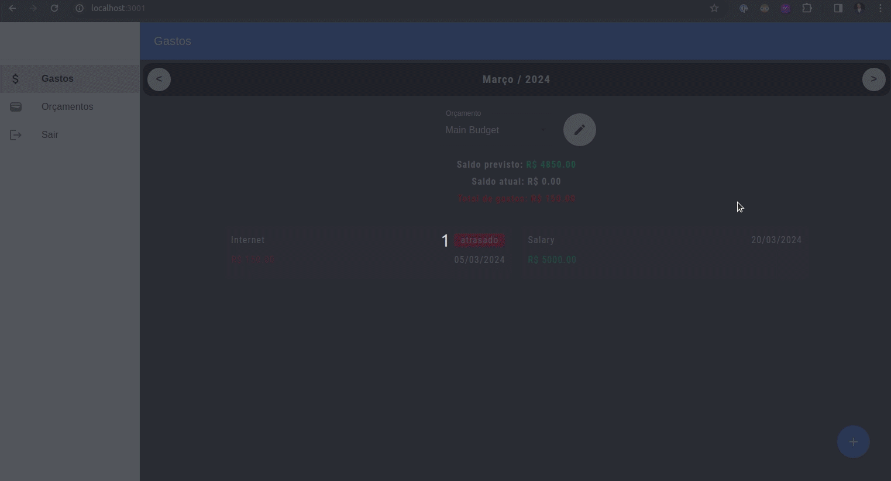

# CO Budget Client
This is the client of a simple budgeting app that allows users to track their expenses and income.

## Main Features
- Authentication
- Users can manage their budgets
- Users can manage their budget's transactions (expenses and income)
  - Transactions can be once, installments, or recurring

## TODO
- [ ] Allow users to invite other users to their budget

This is a [Next.js](https://nextjs.org/) project bootstrapped with [`create-next-app`](https://github.com/vercel/next.js/tree/canary/packages/create-next-app).

## Getting Started

First, run the development server:

```bash
npm run dev
# or
yarn dev
# or
pnpm dev
```

Open [http://localhost:3001](http://localhost:3001) with your browser to see the result.

## App Pages

### Home


### Mobile


## Small Demo

